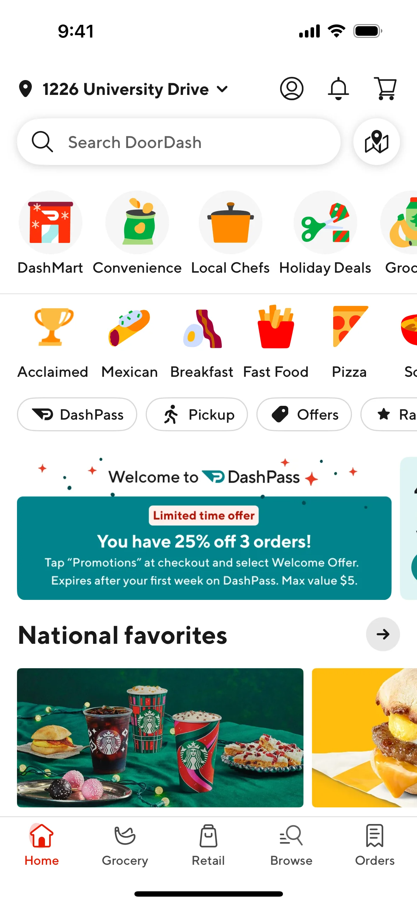

	<a target="_blank" href="https://gitforcetalent.com">
        <picture>
            <source media="(prefers-color-scheme: dark)" srcset="https://gitforcetalent.com/_next/image?url=%2Fimages%2Flogo-light.png&w=1920&q=75">
            <source media="(prefers-color-scheme: light)" srcset="https://gitforcetalent.com/_next/image?url=%2Fimages%2Flogo.png&w=1920&q=75">
            
        </picture>
	</a>
     
     

---

---

# Task: UX Redesign

Your task is to redesign the given screen using Figma or any other design tool of your choice, with the primary goal of improving the user experience (UX).

## Given Screen

## Task Requirements

1. Analyze the given screen and identify areas where the UX can be improved.
2. Create a redesigned version of the screen using Figma or your preferred design tool.
3. Focus on enhancing the overall user experience by considering factors such as:
   - Layout and visual hierarchy
   - Navigation and user flow
   - Readability and accessibility
   - Consistency and design patterns
   - Responsiveness and adaptability to different devices
4. Utilize the provided [UI kit](https://www.figma.com/design/kJdNyLjrI2DhIaW49PpEOd/UI-Starter-Kit?node-id=1823-1994&t=jAJOs1G6qQIqeMNk-1) to maintain a consistent visual language throughout your redesign.
